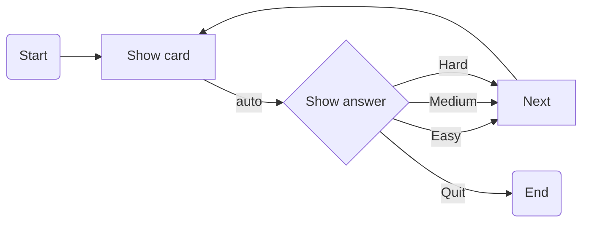
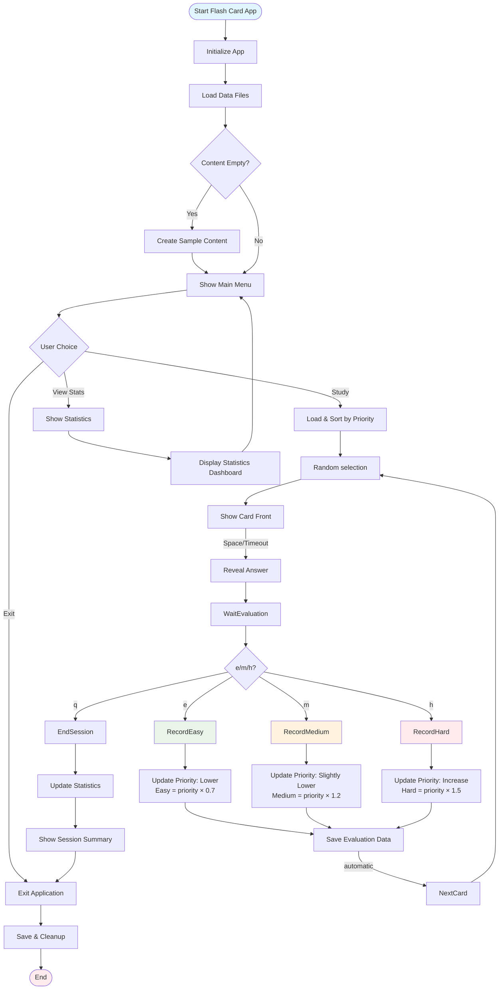
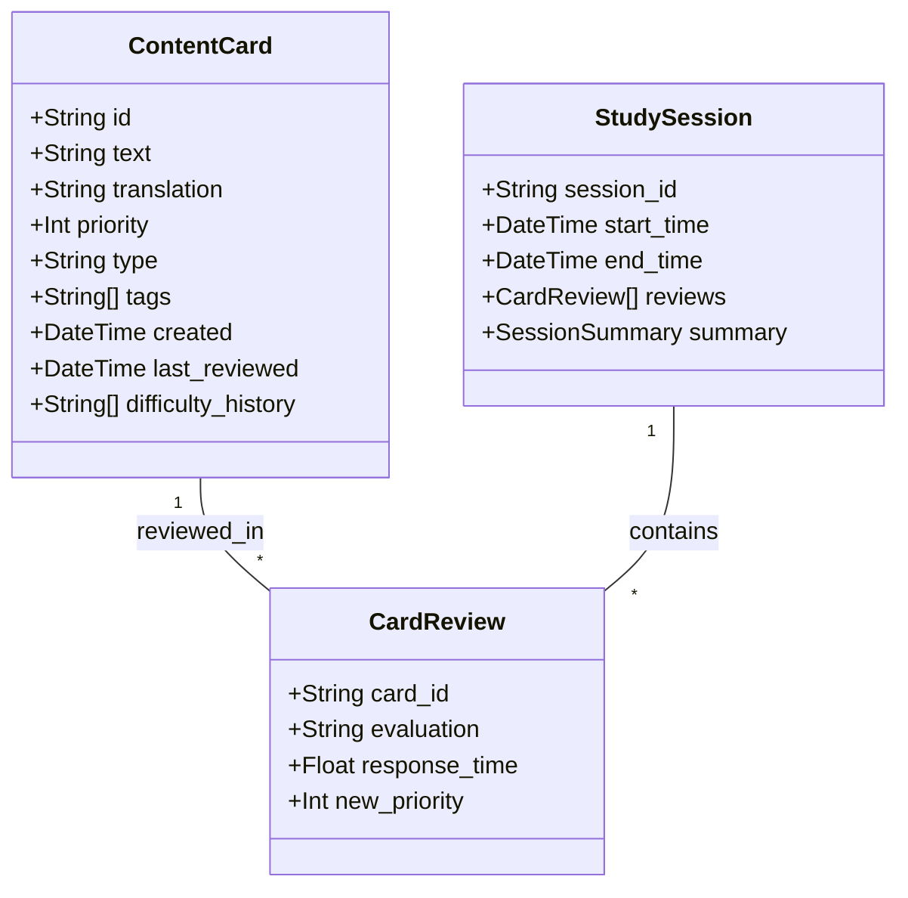

# Flash Card

ターミナル上で動作する自己評価型学習ツール

## 機能

ユーザー自己評価
出題頻度調整


## 使用ツール

bashでCLI APP
tputで画面制御
jsonでカードセット、ログ、統計


## ディレクトリ構成

- Project-root:
    - card: flash card sets
    - data: log, stats
    - docs: Documents
    - snippets: various snippets
    - test: tests
    - notes.md
    - readme.md
    - typing.sh
    - typing_stats.sh
    - flash_card.sh
    - flash_card_stats.sh
    - frame.sh -> Move to lib directory later
    - typing_data.json -> Move to data directory later


## 設計

1. 英語表示
2. 何かキー押すかタイムアウトで日本語表示
3. 自己評価
4. 0.7秒後に次のフレーズ

自己評価
単語・フレーズを自己評価し、e/m/hのキーを押す、結果を保存

自己評価により以降の出題頻度変更
- Default: 1.00
- Easy: 0.7 わかる
- Medium: 1.2 まあまあ
- Hard: 1.5 わからない

ブラウザで以下のファイル表示、Mermaidコードを貼り付けて見れる
`file:///path/to/view_mermaid.html`

概念フロー


詳細フロー図


Data Structure Diagram


Priority Calculation Logic
```
graph LR
    A[Current Priority] --> B{User Evaluation}
    
    B -->|Easy| C[New Priority = Priority × 0.7]
    B -->|Medium| D[New Priority = Priority × 1.2]
    B -->|Hard| E[New Priority = Priority × 1.5]
    
    C --> I[Save Updated Card]
    D --> I
    E --> I
```


## データ構造

CSV,JsonあるいはSQLiteでも
とりあえずCSVで作って、それを元にjsonにする

english.csv
```csv
"Apple","りんご"
"Tomato","トマト"
"Banana","バナナ"
```

あるいはjsonで作る
contents.json
```json
{
  "content-id": "c01"
  "description": "Flash card set",
  "created": "2026-01-18",
  "content": [
    {
      "card-id": "p-001",
      "english": "This is an apple",
      "japanese": "これはりんごです",
      "priority": 1.21,
      "type": "phrase",
      "tags": ["basic", "fruit"],
      "created": "2026-01-18",
      "last_reviewed": "2026-01-18",
      "review_count": 3
    },
    {
      "card-id": "w-001",
      "english": "tomato",
      "japanese": "トマト",
      "priority": 0.88,
      "type": "word",
      "tags": ["basic"],
      "created": "2026-01-19",
      "last_reviewed": "2026-01-20",
      "review_count": 2
    },
    {
      "card-id": "p-002",
      "english": "This is a tomato",
      "japanese": "これはトマトです",
      "priority": 1.11,
      "type": "phrase",
      "tags": ["basic"],
      "created": "2026-01-18",
      "last_reviewed": "2026-01-28",
      "review_count": 12
    }
  ]
}
```

毎回記録するログ
sessions/sessions/2026-01-18.json
```
{
  "session_id": "sess_20260118_013409",
  "start_time": "2026-01-18 01:34:09",
  "end_time": "2026-01-18 01:45:23",
  "duration_seconds": 674,
  "cards_reviewed": 25,
  "contents-id": "c-01",
  "cards": [
    {
      "card_id": "p-001",
      "text": "This is an apple",
      "self_evaluation": "medium",
      "response_time": 1.23,
      "previous_difficulty": "hard",
      "current_priority": 1.12
      "new_priority": 1.77
    }
  ],
  "summary": {
    "easy": 10,
    "medium": 8,
    "hard": 7,
    "avg_response_time": 1.45,
  }
}
```

統計
stats.json
```json
{
  "description": "Learning statistics",
  "total_sessions": 100,
  "total_reviews": 450,
  "evaluation_distribution": {
    "easy": 34,
    "medium": 22,
    "hard": 45
  },
  "today": {
    "date": "2026-01-18",
    "reviews": 30,
    "easy": 4,
    "medium": 21,
    "hard": 4
    "time_spent": "00:15:30"
  },
  "weekly_progress": [
    {"date": "2026-01-11", "reviews": 30},
    {"date": "2026-01-12", "reviews": 28}
  ]
}
```

### UI/UX

Start
```
┏━━━━━━━━━━━━━━━━━━━━━━━━━━━━┓
┃                            ┃
┃        Flash Card          ┃
┃                            ┃
┃          Play              ┃
┃          Stats             ┃
┃          Quite             ┃
┃                            ┃
┗━━━━━━━━━━━━━━━━━━━━━━━━━━━━┛
```


Card1 front
```
┏━━━━━━━━━━━━━━━━━━━━━━━━━━━━┓
┃                            ┃
┃        Apple               ┃
┃                            ┃
┃                            ┃
┃                            ┃
┃                            ┃
┃                            ┃
┗━━━━━━━━━━━━━━━━━━━━━━━━━━━━┛
any key or time out
```

any key or time out
文字数によりタイムアウト設定
読み上げオプション

Card 1 back
```
┏━━━━━━━━━━━━━━━━━━━━━━━━━━━━┓
┃                            ┃
┃        Apple               ┃
┃                            ┃
┃                            ┃
┃     りんご　🍎             ┃
┃                            ┃
┃                            ┃
┗━━━━━━━━━━━━━━━━━━━━━━━━━━━━┛
e - Easy
m - Middle
h - Hard
q - Quite
```

