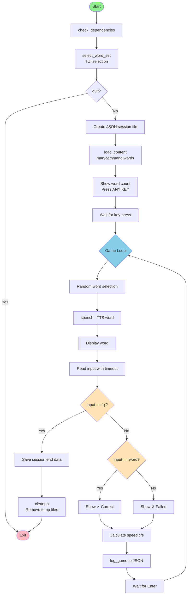

# Typing game

CLI(今の所) タイピングゲーム
英語学習用


## 設定

設定ファイルにするか
```sh
# 設定
PROJECT_ROOT="$(cd "$(dirname "${BASH_SOURCE[0]}")" && git rev-parse --show-toplevel)"

# ログ用変数
SESSION_ID="session_$(date +%Y%m%d_%H%M%S)"
START_TIME=$(date "+%Y-%m-%d %H:%M:%S")
START_SEC=$(date +%s)

SPEECH_FILE="/dev/shm/say_${SESSION_ID}.mp3"
SPEECH=true
```

## フロー



