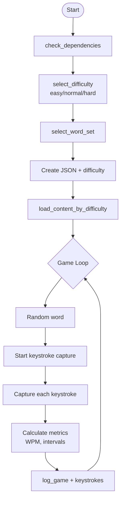

# Typing game

CLI(今の所) タイピングゲーム
英語学習用

## フロー


## Typing Game Enhancement Design

### 1. Difficulty Modes

Mode Parameters
```bash
# Easy Mode
CHAR_RANGE="4-8"
TIME_MULTIPLIER="1.0"  # 文字数 * 1.0秒
WORD_POOL_SIZE=100

# Normal Mode (current default)
CHAR_RANGE="4-15"
TIME_MULTIPLIER="0.6"  # 文字数 * 0.6秒
WORD_POOL_SIZE=200

# Hard Mode
CHAR_RANGE="10-20"
TIME_MULTIPLIER="0.4"  # 文字数 * 0.4秒
WORD_POOL_SIZE=300
```

### Implementation
```bash
select_difficulty() {
    local options=("easy" "normal" "hard")
    local selected=0
    
    # TUI selection logic (similar to select_word_set)
    # Set global variables based on selection
    case "$DIFFICULTY" in
        easy)   CHAR_MIN=4;  CHAR_MAX=8;  TIME_MULT=1.0 ;;
        normal) CHAR_MIN=4;  CHAR_MAX=15; TIME_MULT=0.6 ;;
        hard)   CHAR_MIN=10; CHAR_MAX=20; TIME_MULT=0.4 ;;
    esac
}
```

### 2. Content Organization

Directory Structure
```
data/
├── typing/
│   └── sessions/
│       └── session_YYYYMMDD_HHMMSS.json
└── content/
    ├── easy/
    │   ├── basic-commands.txt
    │   └── common-words.txt
    ├── normal/
    │   ├── man-bash.txt
    │   └── programming-terms.txt
    └── hard/
        ├── man-sentences.txt
        └── technical-jargon.txt
```

Content Loader
```bash
load_content_by_difficulty() {
    local content_dir="$PROJECT_ROOT/data/content/$DIFFICULTY"
    local content_file="$content_dir/${WORD}.txt"
    
    if [ -f "$content_file" ]; then
        mapfile -t word_list < "$content_file"
    else
        # Fallback to dynamic generation
        generate_content_from_man
    fi
}
```

### 3. Keylogger Integration

Data Structure
```json
{
  "session_id": "session_20260204_143022",
  "difficulty": "normal",
  "games": [
    {
      "timestamp": "2026-02-04 14:30:25",
      "word": "command",
      "input": "command",
      "time_taken": 1.23,
      "keystrokes": [
        {"key": "c", "time": 0.15, "interval": 0.15},
        {"key": "o", "time": 0.28, "interval": 0.13},
        {"key": "m", "time": 0.42, "interval": 0.14},
        {"key": "m", "time": 0.55, "interval": 0.13},
        {"key": "a", "time": 0.69, "interval": 0.14},
        {"key": "n", "time": 0.82, "interval": 0.13},
        {"key": "d", "time": 0.95, "interval": 0.13}
      ],
      "metrics": {
        "avg_interval": 0.135,
        "max_interval": 0.15,
        "accuracy": 1.0,
        "wpm": 58.5
      }
    }
  ]
}
```

Keylogger Implementation
```bash
# Requires: script command or custom input handler
capture_keystrokes() {
    local word="$1"
    local keystrokes=()
    local start_time=$(date +%s.%N)
    local last_time=$start_time
    
    while IFS= read -rsn1 char; do
        current_time=$(date +%s.%N)
        interval=$(echo "$current_time - $last_time" | bc)
        timestamp=$(echo "$current_time - $start_time" | bc)
        
        keystrokes+=("{\"key\":\"$char\",\"time\":$timestamp,\"interval\":$interval}")
        last_time=$current_time
        
        echo -n "$char"
        [[ "$char" == $'\n' ]] && break
    done
    
    # Return as JSON array
    printf '[%s]' "$(IFS=,; echo "${keystrokes[*]}")"
}
```

Metrics Calculation
```bash
calculate_metrics() {
    local keystrokes_json="$1"
    local word_length="$2"
    local total_time="$3"
    
    # Calculate average interval
    local avg_interval=$(jq '[.[].interval] | add / length' <<< "$keystrokes_json")
    
    # Calculate WPM (words per minute)
    local wpm=$(echo "scale=2; ($word_length / 5) / ($total_time / 60)" | bc)
    
    # Calculate accuracy (if mistyped keys tracked)
    local accuracy=1.0
    
    jq -n \
        --argjson avg "$avg_interval" \
        --argjson wpm "$wpm" \
        --argjson acc "$accuracy" \
        '{avg_interval: $avg, wpm: $wpm, accuracy: $acc}'
}
```

### 4. Flow Update



### 5. Analysis Features

Session Statistics
```bash
analyze_session() {
    local json_file="$1"
    
    jq '
    {
        total_games: (.games | length),
        avg_wpm: ([.games[].metrics.wpm] | add / length),
        avg_accuracy: ([.games[].metrics.accuracy] | add / length),
        avg_keystroke_interval: ([.games[].metrics.avg_interval] | add / length),
        difficulty: .difficulty
    }
    ' "$json_file"
}
```

Visualization Ideas
- WPM progression over time
- Keystroke heatmap (which keys are slower)
- Accuracy by word length
- Learning curve (improvement over sessions)

