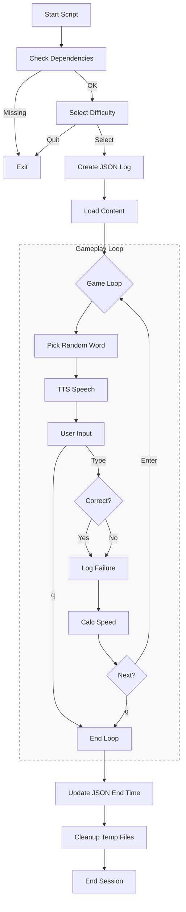
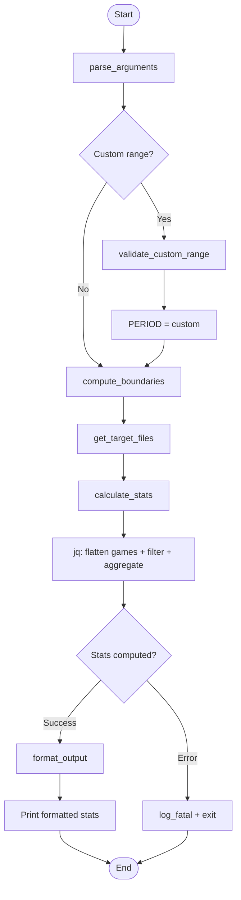
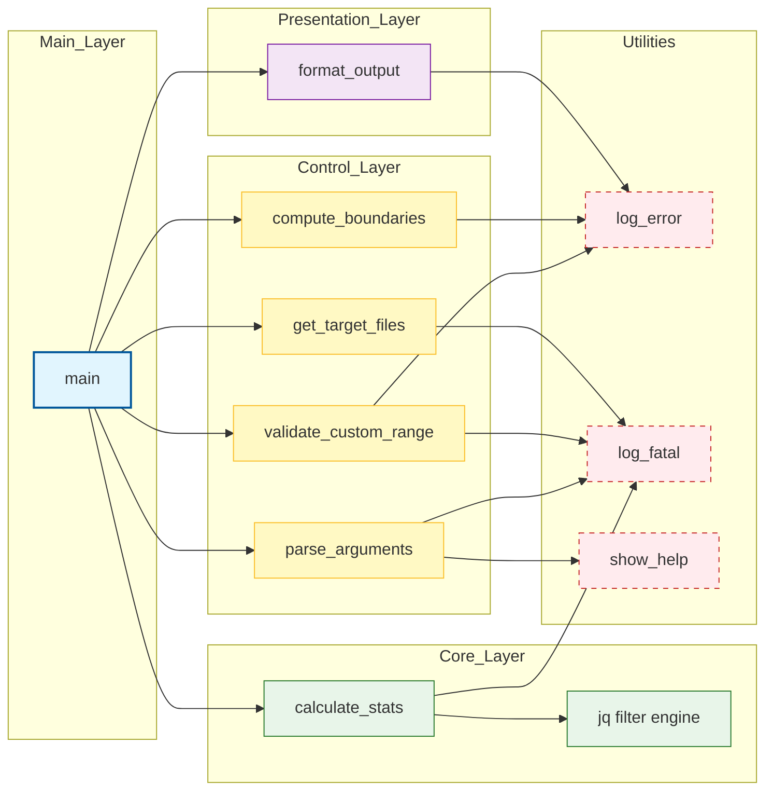
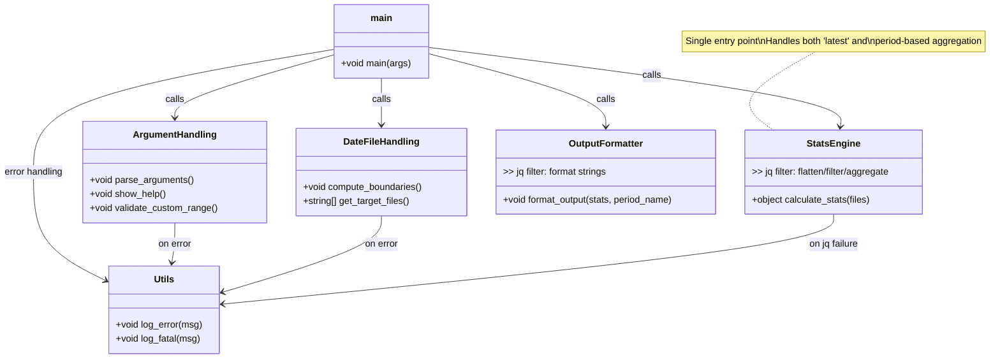

# Typing game

CLI タイピングゲーム

## Directory Structure
```
typing.sh
typing_stats.sh
data/
└── typing/
        └── session_YYYYMMDD_HHMMSS.json
docs/
└── typing.md
```

## typing.sh



## typing_stats.sh

### Execution Flowchart



---

### Function Dependency Chart



---

### Data Flow in `calculate_stats`


---

### Function Call Hierarchy (Tree View)


