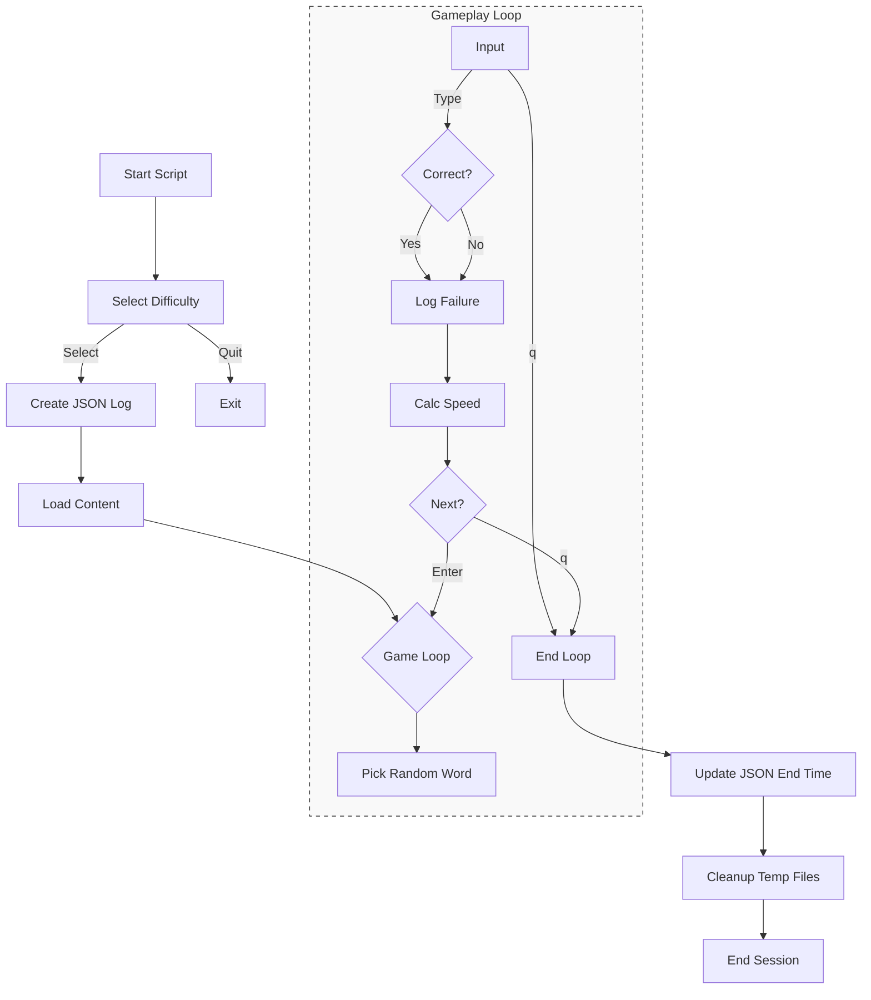
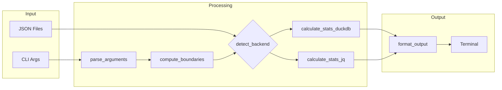
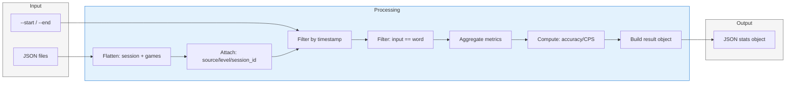
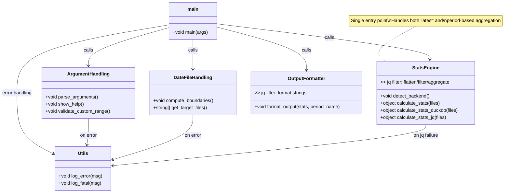

# Typing game

CLI タイピングゲーム

## Directory Structure
```
typing.sh
typing_stats.sh
data/
└── typing/
        └── session_YYYYMMDD_HHMMSS.json
docs/
└── typing.md
```

## typing.sh



## typing_stats.sh

### Execution Flowchart

```mermaid
flowchart TD
    Start([Start]) --> ParseArgs[parse_arguments]
    ParseArgs --> Prep[compute_boundaries + get_files]
    
    Prep --> DetectBackend[detect_backend]
    
    DetectBackend --> CheckEnv{Env Var Set?}
    CheckEnv -->|Yes| UseEnv[Use TYPING_STATS_BACKEND]
    CheckEnv -->|No| CheckCmd{duckdb exists?}
    
    CheckCmd -->|Yes| UseDuckDB[Backend: duckdb]
    CheckCmd -->|No| UseJQ[Backend: jq]
    
    UseEnv --> ValidateBackend{Valid?}
    ValidateBackend -->|Yes| Route
    ValidateBackend -->|No| Fatal[log_fatal]
    
    UseDuckDB --> Route[calculate_stats]
    UseJQ --> Route
    
    Route --> Impl{Which Impl?}
    Impl -->|DuckDB| SQLExec[duckdb -json + SQL]
    Impl -->|jq| JQExec[jq -s + filter]
    
    SQLExec --> Normalize[jq '.[0]' normalization]
    JQExec --> Normalize
    
    Normalize --> FormatOut[format_output]
    FormatOut --> Display[Print Stats]
    Display --> End([End])
    
    Fatal --> End
```

---

### Function Dependency Chart



### Data Flow in `calculate_stats`




### Function Call Hierarchy (Tree View)


